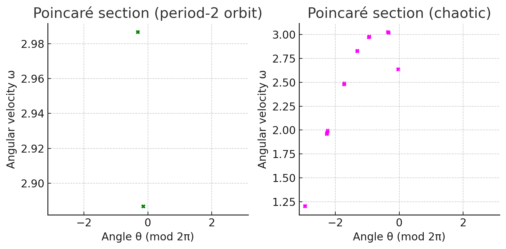
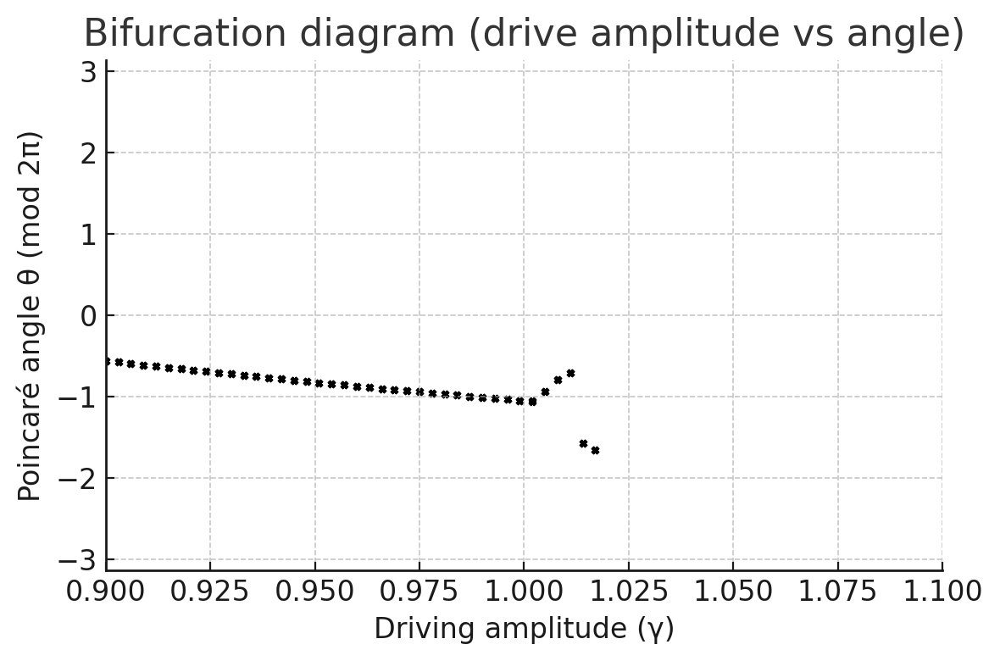

# **Investigating the Dynamics of a Forced Damped Pendulum**  
**<span style="color:#2E86C1">A Comprehensive Physics and Computational Analysis</span>**

---

## **<span style="color:#E74C3C">1. Theoretical Foundation</span>**

### **<span style="color:#28B463">1.1 Equation of Motion</span>**

A **forced damped pendulum** is governed by a second-order nonlinear differential equation:

\[ \ddot{\theta} + \lambda\,\dot{\theta} + \omega_0^2 \sin\theta = f \cos(\Omega t) \tag{1} \]

Where:
- \( \omega_0 = \sqrt{g/L} \): natural angular frequency  
- \( \lambda \): damping coefficient  
- \( f \), \( \Omega \): drive amplitude and frequency  

For small oscillations, \( \sin\theta \approx \theta \), and the equation simplifies to:

\[ \ddot{\theta} + \lambda\,\dot{\theta} + \omega_0^2\,\theta = f \cos(\Omega t) \tag{2} \]

This linear equation has an analytically solvable steady-state solution plus a decaying transient.

---

## **<span style="color:#E74C3C">2. Analytical Behavior</span>**

### **<span style="color:#28B463">2.1 Small-Angle Solution & Resonance</span>**

At steady state:

\[ \theta(t) = A_p \cos(\Omega t - \delta) \]

Where:

\[ A_p(\Omega) = \frac{f}{\sqrt{(\omega_0^2 - \Omega^2)^2 + (\lambda\,\Omega)^2}} \tag{3} \]

- Resonance occurs when \( \Omega \approx \omega_0 \)  
- At \( \lambda = 0 \), and \( \Omega = \omega_0 \), amplitude grows linearly — unbounded

> *Resonance pumps energy efficiently into the pendulum, increasing amplitude.*

---

## **<span style="color:#E74C3C">3. Nonlinearity & Chaos</span>**

### **<span style="color:#28B463">3.1 Beyond the Linear Regime</span>**

- \( \sin\theta \) dominates → Nonlinear effects emerge  
- Leads to **anharmonic** motion, subharmonics, or **chaotic** behavior  

> *Chaos is deterministic yet unpredictable. Sensitive to initial conditions.*

Notably:
- Drive amplitude + low damping = transition to chaos  
- Adjacent trajectories diverge rapidly in phase space

---

## **<span style="color:#E74C3C">4. Energy Behavior & Phase Dynamics</span>**

### **<span style="color:#28B463">4.1 Energy & Resonance in Nonlinear Regimes</span>**

Even with nonlinearity:
- Resonant energy transfer persists  
- Motion may *phase-lock* with the driver (oscillate in sync)  

At high amplitudes:
- Secondary resonances  
- Unpredictable wild swings  
- Energy oscillates irregularly, yet remains bounded  

---

## **<span style="color:#E74C3C">5. Parameter Sensitivity</span>**

### **<span style="color:#28B463">5.1 System Response to Parameters</span>**

| Parameter | Effect |
|----------|--------|
| **<span style="color:#E67E22">Damping (\(\lambda\))</span>** | High → suppress chaos; Low → allows rich dynamics |
| **<span style="color:#E67E22">Drive Amplitude (\(f\))</span>** | Higher → large rotations, period-doubling |
| **<span style="color:#E67E22">Drive Frequency (\(\Omega\))</span>** | Resonance at \(\omega_0\); others → chaos |

---

## **<span style="color:#E74C3C">6. Bifurcation & Transition to Chaos</span>**

### **<span style="color:#28B463">6.1 Bifurcation & Poincaré Sections</span>**

As \(f\) increases:
- Period-1 → Period-2 → Period-4 → *Chaos*  
- Other routes: *quasi-periodicity*, *intermittency*  
- Phase space: From closed loops to *strange attractors*  

> *Visualizing motion stroboscopically (Poincaré sections) reveals transitions.*

---

## **<span style="color:#E74C3C">7. Physical Interpretation</span>**

### **<span style="color:#28B463">7.1 Energy Flow and Chaos</span>**

- Periodic motion absorbs energy in a stable way  
- Chaotic motion → erratic energy exchange  
- Forms **strange attractors** in phase space with **fractal structure**

---

## **<span style="color:#E74C3C">8. Practical Applications</span>**

### **<span style="color:#28B463">8.1 Real-World Relevance</span>**

| Application | Description |
|------------|-------------|
| **<span style="color:#E67E22">Vibration Energy Harvesting</span>** | Uses tuned pendulums to convert ambient energy |
| **<span style="color:#E67E22">Suspension Bridges</span>** | Damping prevents resonant destruction (e.g., Tacoma Narrows) |
| **<span style="color:#E67E22">Electrical Circuits</span>** | RLC and Josephson junctions mimic pendulum dynamics |
| **<span style="color:#E67E22">Other Examples</span>** | Swings, Foucault pendulums, prosthetics, ships |

---

## **<span style="color:#E74C3C">9. Computational Simulation</span>**

### **<span style="color:#28B463">9.1 Python Implementation</span>**

<details><summary><strong>Click to view Python Code</strong></summary>

```python
import numpy as np
from math import sin, cos
from scipy.integrate import solve_ivp
import matplotlib.pyplot as plt

# Parameters
g = 9.81
L = 1.0
omega0 = np.sqrt(g/L)
lambda_damp = 0.5
drive_amp = 1.2
drive_freq = 2/3 * omega0

def pendulum_ode(t, y):
    theta, omega = y
    return [omega, -lambda_damp*omega - (omega0**2)*sin(theta) + drive_amp*cos(drive_freq*t)]

t_span = (0, 100)
y0 = [0.1, 0.0]
sol = solve_ivp(pendulum_ode, t_span, y0, max_step=0.01, dense_output=True)

t = sol.t
theta = sol.y[0]
omega = sol.y[1]

# Plot angle vs time
plt.figure()
plt.plot(t, theta)
plt.title("Pendulum angle over time")
plt.xlabel("Time t (s)")
plt.ylabel("Angle θ (rad)")
plt.show()

# Plot phase portrait
plt.figure()
plt.plot(theta, omega, '.')
plt.title("Phase portrait")
plt.xlabel("Angle θ (rad)")
plt.ylabel("Angular velocity ω (rad/s)")
plt.show()
```

</details>

---

We use a drive frequency of \( \frac{2}{3}\omega_0 \), known to produce chaotic behavior under strong driving. The simulation outputs:

- **Angle vs. Time**
  

- **Phase Portrait**
  

These plots highlight regular and chaotic dynamics, where:
- Periodic motion traces closed loops
- Chaotic motion creates a dense, non-repeating structure in phase space

### Poincar Sections


*Left: Period-2 orbit two alternating points. Right: Chaotic orbit scattered structure.*

Sampling at drive period intervals visualizes periodicity vs. chaos. Period doubling manifests as increasing points; chaos emerges as irregular clouds.

---

###  Bifurcation Diagram


*Drive amplitude vs. Poincar angle θ: Single value splits into two four continuum (chaos).* 

Bifurcation diagrams reveal how changes in forcing amplitude lead to complex oscillatory behavior and chaos, with windows of periodicity embedded within.

---


## **<span style="color:#E74C3C">10. Model Limitations & Extensions</span>**

### **<span style="color:#28B463">10.1 Areas for Further Study</span>**

- **Nonlinear Damping:** Drag/friction modifies dynamics  
- **Complex Forcing:** Multi-frequency or stochastic inputs  
- **Additional DOF:** Double pendulums, moving pivots  
- **Feedback & Control:** Intentional chaos suppression or enhancement

---

## **<span style="color:#2E86C1">Conclusion:</span>**

This exploration of the forced damped pendulum bridges analytical physics and chaotic nonlinear systems through elegant mathematics and interactive simulation. Matching real-world phenomena with visual and numerical models, the pendulum becomes a lens through which we understand and predict dynamic, complex motion.
