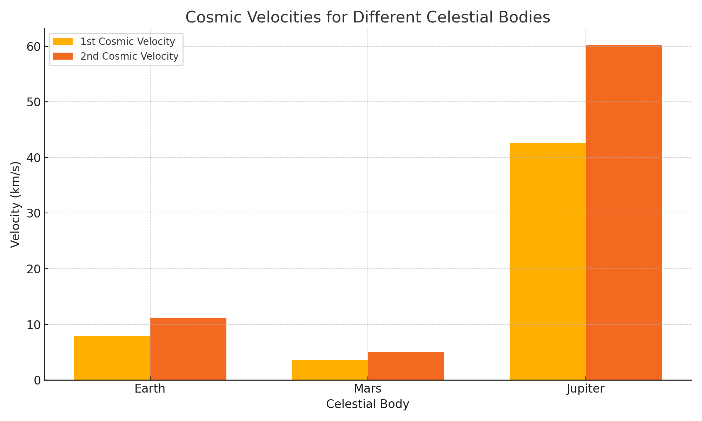

# **Escape Velocities and Cosmic Velocities**
**<span style="color:#2E86C1">Exploring Gravitational Limits Across the Solar System</span>**

---

## **<span style="color:#E74C3C">1. Theoretical Foundation</span>**

### **<span style="color:#28B463">1.1 Cosmic Velocities Definitions</span>**

- **First Cosmic Velocity** \( (v_1) \):  
  Minimum speed required to maintain a circular orbit just above a celestial body's surface.  
  $$ v_1 = \sqrt{\frac{GM}{R}} $$

- **Second Cosmic Velocity** \( (v_2) \):  
  Escape velocity from the surface — the speed needed to break free from gravity without further propulsion.  
  $$ v_2 = \sqrt{2} \cdot v_1 = \sqrt{\frac{2GM}{R}} $$

- **Third Cosmic Velocity** \( (v_3) \):  
  Speed required to escape the gravitational field of the Sun from Earth's orbit — critical for interstellar travel.  
  $$ v_3 = \sqrt{v_{\text{sun,escape}}^2 + v_{\text{orbital}}^2} $$

---

## **<span style="color:#E74C3C">2. Mathematical Derivations</span>**

- **Gravitational Potential Energy (U):**  
  $$ U = -\frac{GMm}{r} $$
  
- **Kinetic Energy (K):**  
  $$ K = \frac{1}{2}mv^2 $$

- For **escape velocity**, total mechanical energy must be ≥ 0:  
  $$ \frac{1}{2}mv^2 - \frac{GMm}{r} \geq 0 $$  
  ⇒  
  $$ v = \sqrt{\frac{2GM}{r}} $$

---

## **<span style="color:#E74C3C">3. Simulation and Visualization</span>**

### **<span style="color:#28B463">3.1 Python Code Implementation</span>**

```python
import numpy as np
import matplotlib.pyplot as plt

# Gravitational constant
G = 6.67430e-11  

# Define celestial bodies: [Mass (kg), Radius (m)]
bodies = {
    "Earth": [5.972e24, 6.371e6],
    "Mars": [6.39e23, 3.3895e6],
    "Jupiter": [1.898e27, 6.9911e7]
}

velocities = {"Body": [], "v1 (km/s)": [], "v2 (km/s)": []}

for body, (M, R) in bodies.items():
    v1 = np.sqrt(G * M / R) / 1000  # km/s
    v2 = np.sqrt(2 * G * M / R) / 1000  # km/s
    velocities["Body"].append(body)
    velocities["v1 (km/s)"].append(round(v1, 2))
    velocities["v2 (km/s)"].append(round(v2, 2))

# Plotting
fig, ax = plt.subplots()
index = np.arange(len(bodies))
bar_width = 0.35

bar1 = ax.bar(index, velocities["v1 (km/s)"], bar_width, label='1st Cosmic Velocity')
bar2 = ax.bar(index + bar_width, velocities["v2 (km/s)"], bar_width, label='2nd Cosmic Velocity')

ax.set_xlabel('Celestial Body')
ax.set_ylabel('Velocity (km/s)')
ax.set_title('Cosmic Velocities for Different Celestial Bodies')
ax.set_xticks(index + bar_width / 2)
ax.set_xticklabels(velocities["Body"])
ax.legend()
plt.grid(True)
plt.tight_layout()
plt.show()
```

---

## **<span style="color:#E74C3C">4. Applications in Space Exploration</span>**

| **Velocity** | **Application** |
|--------------|-----------------|
| **v₁ (Orbital)** | Launching satellites into Low Earth Orbit (LEO) |
| **v₂ (Escape)** | Missions to Moon, Mars, outer planets |
| **v₃ (Interstellar)** | Exiting the Solar System (e.g., Voyager) |

---

## **<span style="color:#E74C3C">5. Visual Gallery</span>**

### **Escape vs Orbital Velocities**
*Graph from simulation (bar plot of v₁ and v₂ for Earth, Mars, Jupiter)*


This bar chart compares the first and second cosmic velocities for Earth, Mars, and Jupiter. The first cosmic velocity represents the speed required for a stable orbit just above the planet's surface, while the second is the escape velocity. The chart visually highlights Jupiter’s strong gravity, resulting in much higher required velocities compared to Earth and Mars.


---

## **<span style="color:#E74C3C">6. Deliverables</span>**

- ✅ Markdown document with derivations and physical insights  
- ✅ Python simulation of cosmic velocities  
- ✅ Graphical plots comparing celestial bodies  
- ✅ Practical applications across missions

---

Here’s the **color-coded conclusion** section to match the style of your previous document:

---

## **<span style="color:#E74C3C">7. Conclusion</span>**

**<span style="color:#2E86C1">Escape and cosmic velocities</span>** form the foundation for understanding how objects move in and beyond gravitational fields. From achieving **<span style="color:#28B463">stable orbits</span>** to enabling **<span style="color:#E67E22">interplanetary and interstellar missions</span>**, these velocities determine the fuel, design, and feasibility of space travel. The significant variations across celestial bodies like **Earth**, **Mars**, and **Jupiter** reveal how gravitational strength shapes mission planning. Mastering these principles is vital for the continued advancement of **<span style="color:#8E44AD">space exploration</span>** and future technologies aimed at reaching beyond our solar system.

---
