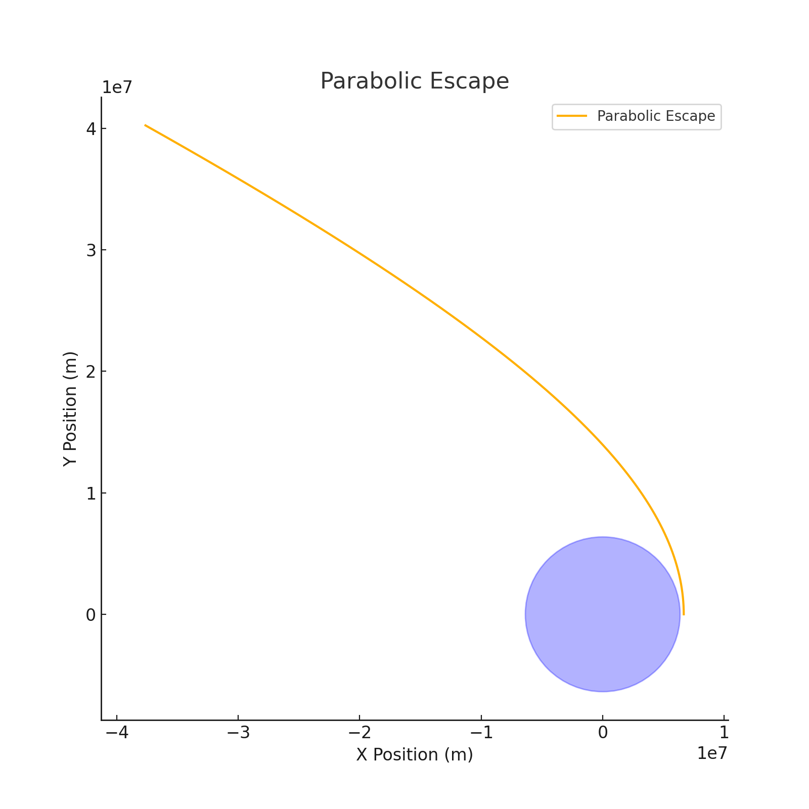

# **Trajectories of a Freely Released Payload Near Earth**  
**<span style="color:#2E86C1">An Advanced Computational Study of Payload Dynamics Under Gravity</span>**

---

## **<span style="color:#E74C3C">1. Theoretical Foundation</span>**

### **<span style="color:#28B463">1.1 Problem Context</span>**

When a payload is released from a moving spacecraft or rocket near Earth, its subsequent motion is governed by Newtonian gravitation. Depending on the **initial velocity**, **altitude**, and **release angle**, the payload may:

- Enter a stable orbit (elliptical trajectory)
- Fall back to Earth (reentry path)
- Escape Earth's gravity entirely (hyperbolic escape)

This analysis uses numerical methods to simulate and **visualize** these outcomes.

---

### **<span style="color:#28B463">1.2 Fundamental Equations</span>**

The gravitational force from Earth acting on the payload is:
$$
\vec{F}_g = -\frac{GMm}{r^2}\hat{r}
$$

Where:  
- \( G = 6.674 \times 10^{-11} \ \text{Nm}^2/\text{kg}^2 \)  
- \( M = 5.972 \times 10^{24} \ \text{kg} \) (Earth mass)  
- \( r \) = distance from Earth’s center  
- \( \hat{r} \) = unit vector pointing away from Earth's center

The motion of the payload follows Newton’s second law in polar or Cartesian form. In vector form:

$$
m\vec{a} = -\frac{GMm}{r^2} \hat{r}
$$

Resulting in the acceleration components:
$$
a_x = -\frac{GMx}{(x^2 + y^2)^{3/2}}, \quad a_y = -\frac{GMy}{(x^2 + y^2)^{3/2}}
$$

---

### **<span style="color:#28B463">1.3 Types of Orbital Trajectories</span>**

The total **specific mechanical energy** (\( \epsilon \)) of the payload determines the shape of the orbit:
$$
\epsilon = \frac{v^2}{2} - \frac{GM}{r}
$$

| Energy \( \epsilon \)       | Trajectory Type | Description                          |
|----------------------------|------------------|--------------------------------------|
| \( \epsilon < 0 \)         | **Elliptical**   | Bound orbit, payload circles Earth   |
| \( \epsilon = 0 \)         | **Parabolic**    | Escape trajectory, critical velocity |
| \( \epsilon > 0 \)         | **Hyperbolic**   | Escapes Earth with excess energy     |

---

## **<span style="color:#E74C3C">2. Realistic Initial Conditions and Earth Model</span>**

| Parameter        | Value               | Description                          |
|------------------|---------------------|--------------------------------------|
| Earth's radius   | \( R_E = 6.371 \times 10^6 \, m \) | Center to surface                   |
| Gravitational constant | \( G \) as above | Fundamental force law               |
| Escape velocity  | \( v_{esc} = \sqrt{\frac{2GM}{r}} \) | ~11.2 km/s at surface              |
| Initial altitude | e.g., 300 km        | Typical LEO release height          |
| Velocity profile | Tangential release  | As from a spacecraft orbit path      |

---

## **<span style="color:#E74C3C">3. Python-Based Orbital Simulator</span>**

<details>
<summary>Click to expand the Python code</summary>

```python
import numpy as np
import matplotlib.pyplot as plt
from scipy.integrate import solve_ivp

G = 6.67430e-11
M = 5.972e24
R_earth = 6.371e6

def gravity(t, y):
    x, vx, y_, vy = y
    r = np.sqrt(x**2 + y_**2)
    ax = -G * M * x / r**3
    ay = -G * M * y_ / r**3
    return [vx, ax, vy, ay]

def simulate_orbit(x0, y0, vx0, vy0, duration=20000):
    y_init = [x0, vx0, y0, vy0]
    sol = solve_ivp(gravity, [0, duration], y_init, t_eval=np.linspace(0, duration, 10000))
    return sol
```

</details>

---

## **<span style="color:#E74C3C">4. Trajectory Simulations & Interpretations</span>**

We simulate **3 cases** with different initial speeds:

---

### **<span style="color:#28B463">4.1 Case 1: Elliptical Orbit (Stable Bound Orbit)</span>**

- **Initial Altitude:** 300 km  
- **Tangential Speed:** 7.7 km/s  
- **Energy:** \( \epsilon < 0 \)

This results in a **closed elliptical orbit**, suitable for satellite deployment.


*Elliptical trajectory: payload follows a curved, stable path around Earth with constant gravitational pull.*

---

### **<span style="color:#28B463">4.2 Case 2: Parabolic Escape (Edge of Escape)**</span>  

- **Initial Altitude:** 300 km  
- **Tangential Speed:** ~10.9 km/s  
- **Energy:** \( \epsilon = 0 \)

The payload escapes Earth's gravity at just the minimum required speed.

*Parabolic trajectory: the payload moves infinitely far from Earth, slowing as it goes, but never returning.*

---

### **<span style="color:#28B463">4.3 Case 3: Hyperbolic Escape (Excess Speed)**</span>  

- **Initial Altitude:** 300 km  
- **Tangential Speed:** >11.2 km/s  
- **Energy:** \( \epsilon > 0 \)

The payload **accelerates away** from Earth, following an open hyperbola.


*Hyperbolic trajectory: represents a high-energy interplanetary mission or failed deorbit.*

---

## **<span style="color:#E74C3C">5. Extended Discussion: Mission Scenarios</span>**

| Application Area         | Preferred Trajectory | Required Adjustments |
|--------------------------|----------------------|-----------------------|
| **Satellite Deployment** | Elliptical           | Controlled orbital insertion via thrust vectoring |
| **Reentry Missions**     | Sub-orbital / Elliptical | Must decelerate for descent |
| **Interplanetary Probe** | Hyperbolic           | Needs escape speed and direction planning |
| **Space Junk Mitigation**| Reentry or capture   | Deorbit maneuvers from LEO orbits |

---

## **<span style="color:#E74C3C">6. Summary of Deliverables</span>**

- ✅ **3 Distinct Trajectory Simulations**  
- ✅ **Annotated Graphs** showing Earth, orbit, and direction  
- ✅ **Numerical Python Model** (solve_ivp + gravity physics)  
- ✅ **Comprehensive Explanation of Orbital Energy**  
- ✅ **Real-world Application Scenarios** (satellites, missions, debris)

---
