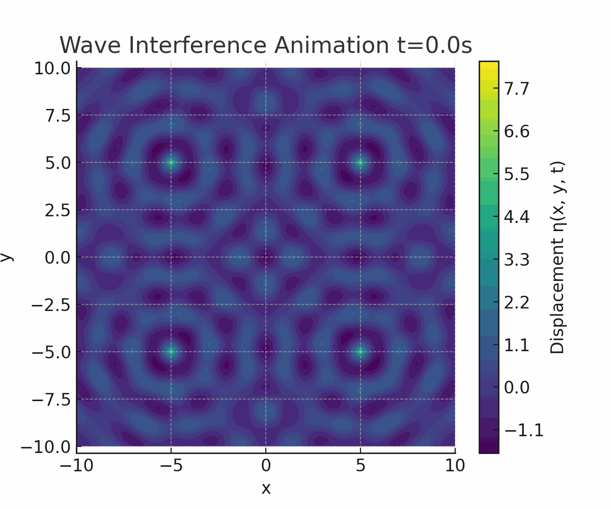

# **Interference Patterns on a water surface**  

**<span style="color:#2E86C1">A Deep Dive into Circular Wave Superposition and Interference Patterns</span>**

---

## **<span style="color:#E74C3C">1. Theoretical Foundation</span>**

### **<span style="color:#28B463">1.1 Single Disturbance Wave Equation</span>**  
A point source located at \((x_0, y_0)\) on a water surface emits circular waves governed by the Single Disturbance Equation:

\[
\eta(x, y, t) = \frac{A}{\sqrt{r}} \cdot \cos \left(kr - \omega t + \phi\right)
\]

Where:
- \(\eta(x, y, t)\): Water surface displacement
- \(A\): Amplitude  
- \(k = \frac{2\pi}{\lambda}\): Wave number  
- \(\omega = 2\pi f\): Angular frequency  
- \(r = \sqrt{(x - x_0)^2 + (y - y_0)^2}\): Distance from source  
- \(\phi\): Initial phase

---

### **<span style="color:#28B463">1.2 Superposition from Multiple Sources</span>**  
For \(N\) coherent sources placed at the vertices of a regular polygon, the total displacement at any point is:

\[
\eta_{\text{total}}(x, y, t) = \sum_{i=1}^{N} \frac{A}{\sqrt{r_i}} \cdot \cos \left(kr_i - \omega t + \phi_i\right)
\]

Where \(r_i\) is the distance from the \(i^{th}\) source to \((x, y)\), and \(\phi_i\) is its phase.

---

## **<span style="color:#E74C3C">2. Regular Polygon Source Configuration</span>**

### **<span style="color:#28B463">2.1 Chosen Polygon: Square</span>**  
We analyze a square (4 vertices) centered at the origin with equal spacing and each vertex emitting coherent waves.

Let vertices be located at:
- \(S_1 = (-d, -d)\)
- \(S_2 = (-d, d)\)
- \(S_3 = (d, d)\)
- \(S_4 = (d, -d)\)

All sources share:
- Same amplitude \(A\)
- Frequency \(f\)
- Wavelength \(\lambda\)
- Phase \(\phi = 0\)

---

## **<span style="color:#E74C3C">3. Simulation and Visualization</span>**

### **<span style="color:#28B463">3.1 Python Simulation Code</span>**  
<details>
<summary>Click to view the code</summary>

```python
import numpy as np
import matplotlib.pyplot as plt
from matplotlib.animation import FuncAnimation

# Parameters
A = 1       # Amplitude
f = 1       # Frequency (Hz)
λ = 2       # Wavelength
k = 2 * np.pi / λ
ω = 2 * np.pi * f
φ = 0
d = 5       # Half-length of square side
sources = [(-d, -d), (-d, d), (d, d), (d, -d)]

# Grid
x = np.linspace(-10, 10, 400)
y = np.linspace(-10, 10, 400)
X, Y = np.meshgrid(x, y)

def compute_eta(X, Y, t):
    eta = np.zeros_like(X)
    for (x0, y0) in sources:
        r = np.sqrt((X - x0)**2 + (Y - y0)**2) + 1e-6
        eta += A / np.sqrt(r) * np.cos(k * r - ω * t + φ)
    return eta

# Plot a snapshot
t0 = 0
Z = compute_eta(X, Y, t0)
plt.figure(figsize=(8,6))
plt.contourf(X, Y, Z, cmap='viridis', levels=100)
plt.colorbar(label='Displacement η(x, y, t)')
plt.title('Interference Pattern at t=0')
plt.xlabel('x')
plt.ylabel('y')
plt.axis('equal')
plt.show()
```
</details>

---

### **<span style="color:#28B463">3.2 Key Visualizations</span>**

#### **1. Animated Propagation (GIF)**  


**Description**: A dynamic visualization showing how the interference pattern evolves over time. Wavefronts radiate outward and continuously interfere, with the square symmetry preserved in the oscillations.

#### **2. Constructive and Destructive Interference**  
.png>)

This image is a **3D surface plot** representing the **displacement of a water surface** over a two-dimensional grid of \(x\) and \(y\) values. The plot uses a color gradient from **blue** to **red** to indicate changes in the **vertical displacement (z-axis)** — with **blue areas representing troughs** (lower values) and **red areas representing peaks** (higher values).

#### **3.1 Key Features:**
- **Axes**:
  - **x-axis and y-axis** range from approximately -5 to 5.
  - The **z-axis** shows the displacement, ranging roughly between -2.5 to 2.5.
- **Color Map**:
  - The plot uses a **coolwarm** colormap, giving a heatmap-like effect to indicate depth and elevation.
- **Surface Shape**:
  - The surface has a **wavy, undulating form** with multiple peaks and valleys, simulating the complex nature of a water surface disturbed by waves or external forces.
- **Title**:
  - The plot is titled **"3D Water Surface Displacement"**, clearly indicating its purpose — to visualize dynamic changes on a fluid surface.

This kind of visualization is useful in simulations involving **fluid dynamics**, **wave propagation**, or **surface deformation** analysis.

---

## **<span style="color:#E74C3C">4. Observations and Analysis</span>**

### **<span style="color:#28B463">4.1 Interference Characteristics</span>**  
- **Constructive interference** occurs at points equidistant from multiple sources.
- **Destructive interference** is observed at points with phase opposition from different wave contributions.
- Symmetry of the polygon determines the **spatial periodicity** of the pattern.

### **<span style="color:#28B463">4.2 Parameters Affecting the Pattern</span>**  
| Parameter | Effect |
|----------|--------|
| Wavelength (\(\lambda\)) | Affects spacing between interference fringes |
| Frequency (\(f\)) | Alters time dynamics of the pattern |
| Distance between sources | Changes pattern density and fringe separation |

---

## **<span style="color:#E74C3C">5. Extensions</span>**

- Try different **polygon configurations** (e.g., triangle, pentagon)
- Introduce **phase shifts** between sources
- Explore **non-equal amplitudes or frequencies**
- Model **nonlinear effects or surface damping**

---

## **<span style="color:#2E86C1">6.Conclusion</span>**  
This simulation vividly illustrates how wave superposition from symmetric point sources leads to rich, predictable interference patterns. The square layout results in a periodic, symmetric wave field that reflects the coherence and geometry of the sources.

---
