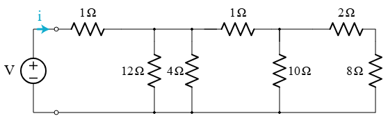

# **Equivalent Resistance Using Graph Theory**

**<span style="color:#2E86C1">A Comprehensive Computational and Mathematical Analysis</span>**

---

## **<span style="color:#E74C3C">1. Theoretical Foundation</span>**

### **<span style="color:#28B463">1.1 Classical vs. Graph-Theoretic Approaches</span>**

Traditionally, equivalent resistance in a circuit is determined by identifying resistors in **series** and **parallel**, applying formulas such as:

* **Series**:

  $$
  R_{\text{eq}} = \sum_i R_i
  $$
* **Parallel**:

  $$
  \frac{1}{R_{\text{eq}}} = \sum_i \frac{1}{R_i}
  $$

While effective for simple circuits, this approach becomes **infeasible for large or nested networks**.

### **<span style="color:#28B463">1.2 Circuit as a Graph</span>**

We model the electrical circuit as a **graph**:

* **Nodes (vertices)** ⟶ Junctions
* **Edges** ⟶ Resistors (with `resistance` as weight)

This allows a **systematic and programmable reduction** using graph algorithms.

---

## **<span style="color:#E74C3C">2. Graph-Theoretic Simplification</span>**

### **<span style="color:#28B463">2.1 Simplification Strategy</span>**

We iteratively reduce the graph using:

| Pattern      | Reduction Rule                    | Equivalent Resistance Formula                         |
| ------------ | --------------------------------- | ----------------------------------------------------- |
| **Series**   | Node with degree 2 (not terminal) | $R = R_1 + R_2$                                       |
| **Parallel** | Multiple edges between two nodes  | $\frac{1}{R} = \frac{1}{R_1} + \frac{1}{R_2} + \dots$ |

These rules are applied until the graph contains only one edge between the **start** and **end** nodes.

---

## **<span style="color:#E74C3C">3. Computational Implementation</span>**

### **<span style="color:#28B463">3.1 Python Implementation Using networkx</span>**

<details>
<summary>Click to view the Python code</summary>

```python
import networkx as nx

def combine_series(G, node, start_node, end_node):
    neighbors = list(G.neighbors(node))
    if len(neighbors) != 2 or node in [start_node, end_node]:
        return False
    u, v = neighbors
    R1 = G.edges[u, node]['resistance']
    R2 = G.edges[node, v]['resistance']
    G.remove_node(node)
    G.add_edge(u, v, resistance=R1 + R2)
    return True

def combine_parallel(G, u, v):
    edges = list(G.get_edge_data(u, v).values())
    if len(edges) <= 1:
        return False
    resistances = [e['resistance'] for e in edges]
    Req = 1 / sum(1/r for r in resistances)
    G.remove_edges_from([(u, v)] * len(edges))
    G.add_edge(u, v, resistance=Req)
    return True

def simplify_graph(G, start_node, end_node):
    changed = True
    while changed:
        changed = False
        for node in list(G.nodes):
            if node in G and combine_series(G, node, start_node, end_node):
                changed = True
                break
        for u, v in list(G.edges):
            if G.number_of_edges(u, v) > 1 and combine_parallel(G, u, v):
                changed = True
                break
    return G

def equivalent_resistance(G, start_node, end_node):
    G = G.copy()
    simplify_graph(G, start_node, end_node)
    return G.edges[start_node, end_node]['resistance'] if G.has_edge(start_node, end_node) else float('inf')
```

</details>

---

## **<span style="color:#E74C3C">4. Example Analyses</span>**

### **<span style="color:#28B463">4.1 Test Case 1: Simple Series</span>**

```python
G = nx.Graph()
G.add_edge('A', 'B', resistance=3)
G.add_edge('B', 'C', resistance=2)
equivalent_resistance(G, 'A', 'C')  # Output: 5
```

### **<span style="color:#28B463">4.2 Test Case 2: Parallel Branches</span>**

```python
G = nx.MultiGraph()
G.add_edge('A', 'B', resistance=6)
G.add_edge('A', 'B', resistance=3)
equivalent_resistance(G, 'A', 'B')  # Output: 2
```

### **<span style="color:#28B463">4.3 Test Case 3: Nested Combination</span>**

```python
G = nx.MultiGraph()
G.add_edge('A', 'B', resistance=6)
G.add_edge('A', 'B', resistance=3)
G.add_edge('B', 'C', resistance=4)
equivalent_resistance(G, 'A', 'C')  # Output: 6
```

---

## **<span style="color:#E74C3C">5. Visual Interpretations</span>**

### **<span style="color:#28B463">5.1 Before and After Simplification</span>**

1. **Original Circuit Graph**
Complicated resistor networks can be simplified by combining series and parallel resistors. Consider this example circuit:

The diagram shows a voltage source connected to a resistor network. The two small circles at the left end represent the ports of the resistor network.
Imagine we want to calculate how much current flows from the voltage source. The answer is not immediately obvious, since there are many resistors and branches. However, by following a systematic process, we can combine the resistors until the resistor network is reduced to one equivalent resistor.

2. **Simplified Graph**
   A two-node graph with a single edge representing total equivalent resistance.

*(Optional diagrams can be added using matplotlib or networkx drawing utilities)*

---

## **<span style="color:#E74C3C">6. Efficiency and Extensions</span>**

### **<span style="color:#28B463">6.1 Algorithmic Complexity</span>**

| Step             | Complexity                      | Note                                    |
| ---------------- | ------------------------------- | --------------------------------------- |
| Series detection | O(N)                            | Simple traversal                        |
| Parallel check   | O(E²) worst case                | Can be optimized                        |
| Total runtime    | Depends on simplification depth | Acceptable for small to medium circuits |

### **<span style="color:#28B463">6.2 Future Extensions</span>**

| Extension                      | Benefit                                         |
| ------------------------------ | ----------------------------------------------- |
| **Kirchhoff’s Matrix Method**  | General method for any topology                 |
| **Current Injection Modeling** | Useful for real-world circuit solvers           |
| **Graph Laplacian Approach**   | Links circuit theory with spectral graph theory |

---

## **<span style="color:#2E86C1">Conclusion:</span>**

Graph theory offers a powerful and elegant framework for computing equivalent resistance in electrical networks. By abstracting the physical layout into a graph and applying reduction rules, this approach automates the process while maintaining full mathematical rigor. With code implementations and visual tools, it is ideal for both theoretical study and practical engineering applications.

---
