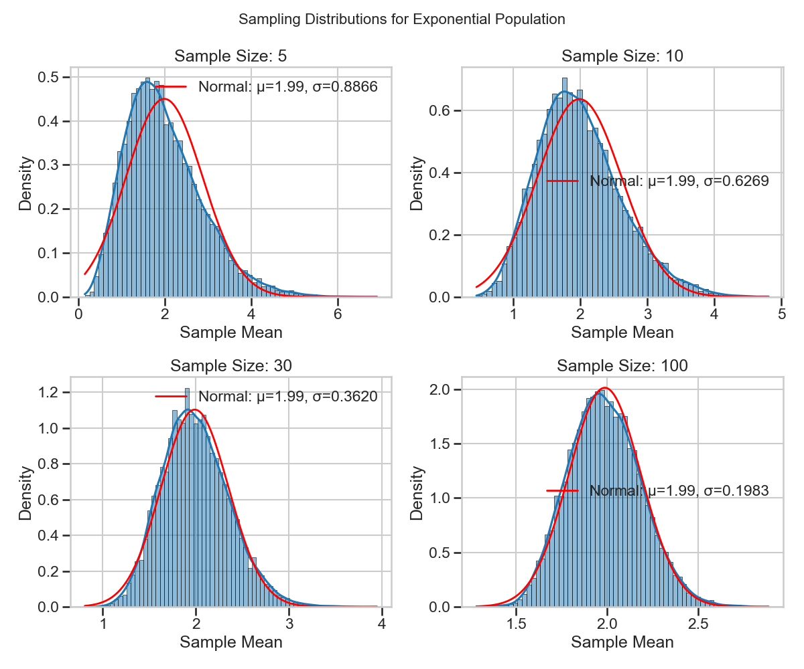
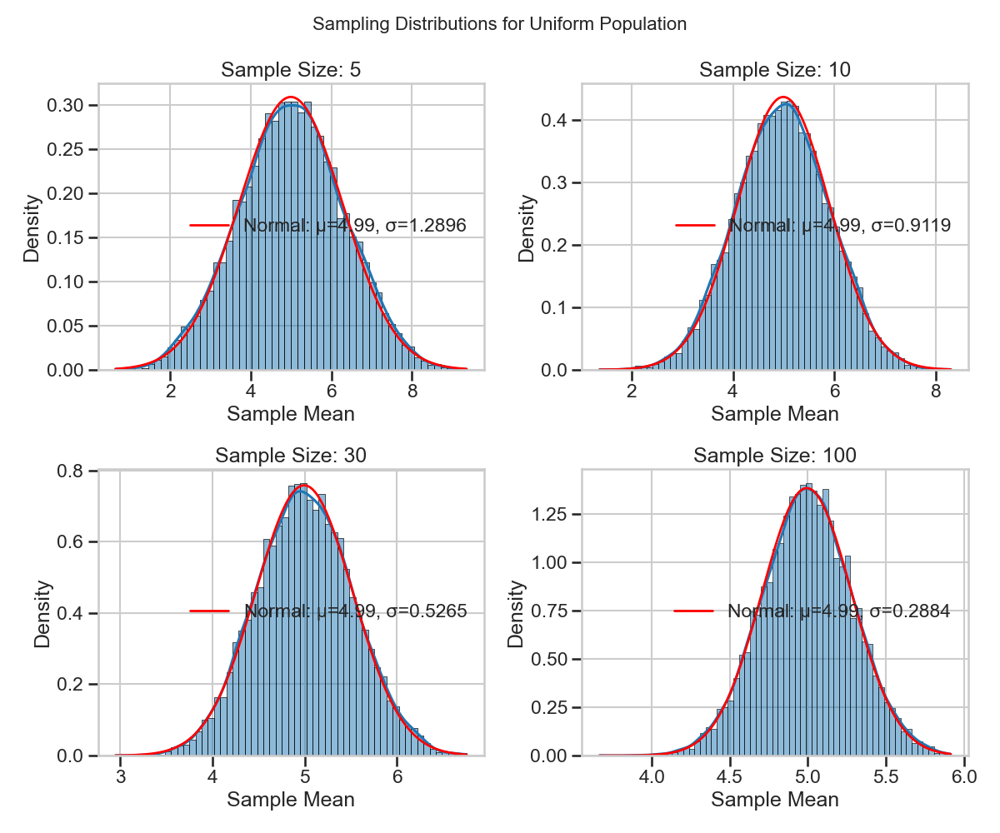
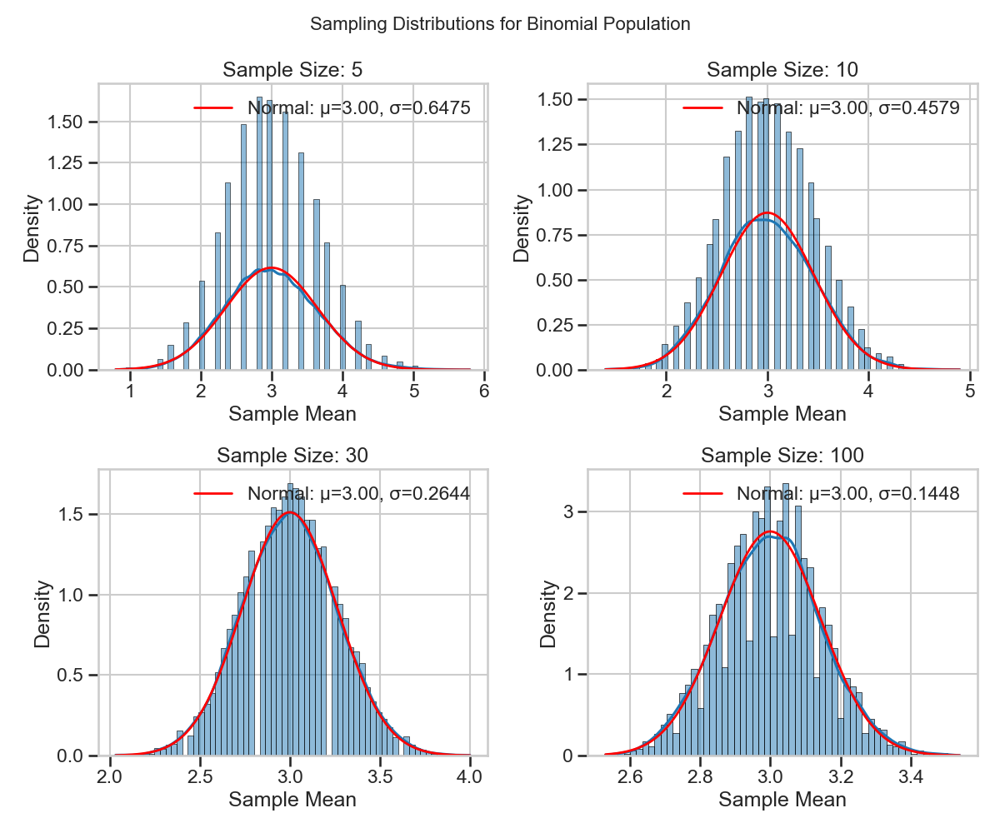

Exploring the Central Limit Theorem through Simulations

1. Theoretical Background

The Central Limit Theorem (CLT) is one of the most important theorems in statistics. It states that when independent random variables are added, their properly normalized sum tends toward a normal distribution even if the original variables themselves are not normally distributed.

More formally, if $X_1, X_2, \ldots, X_n$ are independent and identically distributed random variables with mean $\mu$ and variance $\sigma^2 < \infty$, then as $n$ approaches infinity, the random variable $\sqrt{n}(\bar{X}_n - \mu)$ converges in distribution to a normal $N(0, \sigma^2)$:

$$\sqrt{n}(\bar{X}_n - \mu) \xrightarrow{d} N(0, \sigma^2)$$

Where $\bar{X}_n = \frac{1}{n}\sum_{i=1}^{n} X_i$ is the sample mean.

This can be equivalently expressed as:

$$\bar{X}_n \xrightarrow{d} N\left(\mu, \frac{\sigma^2}{n}\right)$$

The theorem has several important implications:

1. The sampling distribution of the mean approaches a normal distribution as sample size increases, regardless of the shape of the population distribution.
2. The mean of the sampling distribution equals the population mean $\mu$.
3. The standard deviation of the sampling distribution (standard error) equals $\frac{\sigma}{\sqrt{n}}$.

## Simulation Approach

To demonstrate the Central Limit Theorem, we'll:

1. Generate large populations from different probability distributions
2. Take repeated samples of different sizes from each population
3. Calculate the mean of each sample
4. Plot the distribution of these sample means
5. Compare the results with theoretical predictions

## Population Distributions

We'll examine three fundamentally different distributions:

### 1. Uniform Distribution

The continuous uniform distribution has equal probability density across its range $[a, b]$:

$$f(x) = \begin{cases} 
\frac{1}{b-a} & \text{for } a \leq x \leq b \\
0 & \text{for } x < a \text{ or } x > b
\end{cases}$$

With mean $\mu = \frac{a+b}{2}$ and variance $\sigma^2 = \frac{(b-a)^2}{12}$

### 2. Exponential Distribution

The exponential distribution models the time between events in a Poisson process:

$$f(x) = \begin{cases} 
\lambda e^{-\lambda x} & \text{for } x \geq 0 \\
0 & \text{for } x < 0
\end{cases}$$

With mean $\mu = \frac{1}{\lambda}$ and variance $\sigma^2 = \frac{1}{\lambda^2}$

3. Python Simulation Code

 
Click to view the Python code

python
Copy
Edit
import numpy as np
import matplotlib.pyplot as plt
import seaborn as sns

def simulate_clt(distribution, dist_params, sample_sizes, num_samples=1000):
    np.random.seed(0)
    pop_size = 10000
    if distribution == 'uniform':
        population = np.random.uniform(**dist_params, size=pop_size)
    elif distribution == 'exponential':
        population = np.random.exponential(scale=dist_params['scale'], size=pop_size)
    elif distribution == 'binomial':
        population = np.random.binomial(n=dist_params['n'], p=dist_params['p'], size=pop_size)
    else:
        raise ValueError("Unsupported distribution")

    fig, axes = plt.subplots(1, len(sample_sizes), figsize=(20, 4))
    for i, size in enumerate(sample_sizes):
        sample_means = [np.mean(np.random.choice(population, size=size, replace=False)) for _ in range(num_samples)]
        sns.histplot(sample_means, kde=True, ax=axes[i], bins=30, color='skyblue')
        axes[i].set_title(f'Sample Size = {size}')
        axes[i].set_xlabel('Sample Mean')
        axes[i].set_ylabel('Frequency')
    plt.suptitle(f'CLT Simulation - {distribution.title()} Distribution')
    plt.tight_layout()
    plt.show()

# Example usage
simulate_clt('uniform', {'low': 0, 'high': 100}, [5, 10, 30, 50])
simulate_clt('exponential', {'scale': 10}, [5, 10, 30, 50])
simulate_clt('binomial', {'n': 10, 'p': 0.5}, [5, 10, 30, 50])

### 4. Binomial Distribution

The binomial distribution models the number of successes in $n$ independent trials:

$$P(X = k) = \binom{n}{k} p^k (1-p)^{n-k}$$

With mean $\mu = np$ and variance $\sigma^2 = np(1-p)$

 
 

## Conclusions

Our simulations clearly demonstrate the Central Limit Theorem in action:

1. **Convergence to Normality**: All three distributions (uniform, exponential, and binomial) show sampling distributions that become increasingly normal as sample size increases.

2. **Standard Error Reduction**: The standard error of the sampling distribution decreases proportionally to $\frac{1}{\sqrt{n}}$ as predicted by theory.

3. **Distribution Shape Effects**: The original shape of the population distribution affects how quickly the sampling distribution converges to normality:
   - The uniform distribution converges relatively quickly
   - The exponential distribution (highly skewed) requires larger sample sizes
   - The binomial distribution shows discreteness effects at small sample sizes

4. **Practical Implications**: The CLT allows us to make probability statements about sample means even when we don't know the exact shape of the population distribution, provided the sample size is sufficiently large.

These results validate the theoretical predictions of the Central Limit Theorem and demonstrate its robustness across different types of probability distributions.